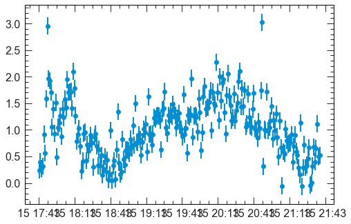
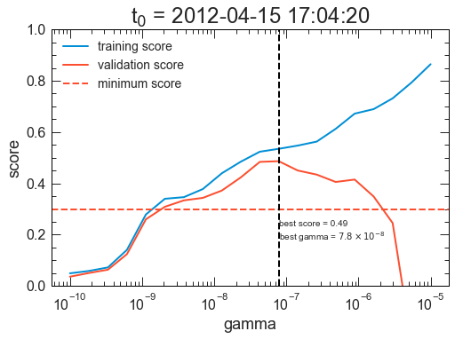
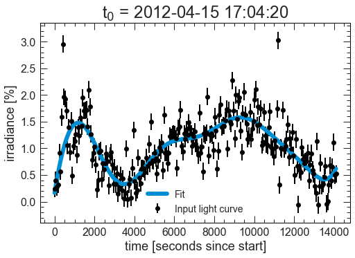

{:.input_area}
```python
# prototype only: load some example dimming light curve data
minimum_score = 0.3
plots_save_path='./'
verbose = True
from scipy.io.idl import readsav
idl_generated_data = readsav('/Users/jmason86/Dropbox/Research/Postdoc_NASA/Analysis/Coronal Dimming Analysis/Example Dimming Light Curve.sav')
from calculate_eve_fe_line_precision import calculate_eve_fe_line_precision
uncertainty = calculate_eve_fe_line_precision()[3] * 100. + np.zeros(len(idl_generated_data.yyyydoy)) # * 100 for [%]
light_curve_df = pd.DataFrame({'irradiance': idl_generated_data.irradiance[:, 3],
                               'uncertainty': uncertainty})
light_curve_df.index = yyyydoy_sod_to_datetime(idl_generated_data.yyyydoy, idl_generated_data.sod) # Convert EVE to datetime
light_curve_df.head()
```


<div markdown="0">
<div>
<style scoped>
    .dataframe tbody tr th:only-of-type {
        vertical-align: middle;
    }

    .dataframe tbody tr th {
        vertical-align: top;
    }

    .dataframe thead th {
        text-align: right;
    }
</style>
<table border="1" class="dataframe">
  <thead>
    <tr style="text-align: right;">
      <th></th>
      <th>irradiance</th>
      <th>uncertainty</th>
    </tr>
  </thead>
  <tbody>
    <tr>
      <th>2012-04-15 17:43:20</th>
      <td>0.246831</td>
      <td>0.160099</td>
    </tr>
    <tr>
      <th>2012-04-15 17:44:19</th>
      <td>0.399922</td>
      <td>0.160099</td>
    </tr>
    <tr>
      <th>2012-04-15 17:45:18</th>
      <td>0.275836</td>
      <td>0.160099</td>
    </tr>
    <tr>
      <th>2012-04-15 17:46:17</th>
      <td>0.319487</td>
      <td>0.160099</td>
    </tr>
    <tr>
      <th>2012-04-15 17:47:16</th>
      <td>0.920058</td>
      <td>0.160099</td>
    </tr>
  </tbody>
</table>
</div>
</div>


{:.input_area}
```python
# prototype only: just taking a look at the data
import matplotlib.pyplot as plt
%matplotlib inline
plt.style.use('jpm-transparent-light')
plt.errorbar(light_curve_df.index, light_curve_df['irradiance'], yerr=light_curve_df['uncertainty'], fmt='o');
```





{:.input_area}
```python
# Prepare the logger for verbose
if verbose:
    # TODO: Update the path
    logger = JpmLogger(filename='automatic_fit_light_curve_log', path='/Users/jmason86/Desktop/')

# Pull data out of the DataFrame for compatibility formatting
X = metatimes_to_seconds_since_start(light_curve_df.index)
y = light_curve_df['irradiance'].values

# Check for NaNs and issue warning that they are being removed from the dataset
if verbose:
    if np.isnan(y).any():
        logger.warning("There are NaN values in light curve. Dropping them.")
finite_irradiance_indices = np.isfinite(y)
X = X[finite_irradiance_indices]
X = X.reshape(len(X), 1) # Format to be compatible with validation_curve and SVR.fit()
uncertainty = uncertainty[np.isfinite(y)]
y = y[finite_irradiance_indices]

if verbose:
    logger.info("Fitting %s points." % len(y))
```


{:.input_area}
```python
# Helper function for compatibility with validation_curve
def jpm_svr(gamma=5e-8, **kwargs):
    return make_pipeline(SVR(kernel='rbf', C=1e3, gamma=gamma, **kwargs))
```


{:.input_area}
```python
# Hyper parameter for SVR is gamma, so generate values of it to try
#gamma = np.array([5e-8])
gamma = np.logspace(-10, -5, num=20, base=10)
#gamma = np.linspace(5e-8, 1e-7, num=1)

# Overwrite the default scorer (R^2) with explained variance score
evs = make_scorer(explained_variance_score)

# Split the data between training/testing 50/50 but across the whole time range rather than the default consecutive Kfolds
shuffle_split = ShuffleSplit(n_splits=20, train_size=0.5, test_size=0.5, random_state=None)

# Generate the validation curve -- test all them gammas!
# Parallelized to speed it up (n_jobs = # of parallel threads)
train_score, val_score = validation_curve(jpm_svr(), X, y,
                                          'svr__gamma',
                                          gamma, cv=shuffle_split, n_jobs=7, scoring=evs)

if verbose:
    logger.info("Validation curve complete.")
```


{:.input_area}
```python
# Identify the best score
scores = np.median(val_score, axis=1)
best_fit_score = np.max(scores)
best_fit_gamma = gamma[np.argmax(scores)]
if verbose:
    logger.info('Scores: ' + str(scores))
    logger.info('Best score: ' + str(best_fit_score))
    logger.info('Best fit gamma: ' + str(best_fit_gamma))

# Return None if only got bad fits
if best_fit_score < minimum_score:
    if verbose:
        logger.warning("Uh oh. Best fit score {0:.2f} is < user-defined minimum score {1:.2f}".format(best_fit_score, minimum_score))
    #return None, best_fit_gamma, best_fit_score  # TODO: Uncomment for non-prototype
```


{:.input_area}
```python
if plots_save_path and np.size(gamma) > 1:
    plt.style.use('jpm-transparent-light')
    p1 = plt.plot(gamma, np.median(train_score, 1), label='training score')
    p2 = plt.plot(gamma, np.median(val_score, 1), label='validation score')
    ax = plt.axes()
    plt.title("t$_0$ = " + datetimeindex_to_human(light_curve_df.index)[0])
    ax.set_xscale('log')
    plt.xlabel('gamma')
    plt.ylabel('score')
    plt.ylim(0, 1)
    p3 = plt.axhline(y=minimum_score, linestyle='dashed', color=p2[0].get_color(), label='minimum score')
    p4 = plt.axvline(x=best_fit_gamma, linestyle='dashed', color='black')
    t1 = plt.text(best_fit_gamma, minimum_score - 0.05, 'best score = ' + latex_float(best_fit_score) + '\nbest gamma = ' + latex_float(best_fit_gamma),
                  ha='left', va='top')
    plt.legend(loc='best')
    filename = plots_save_path + 'Validation Curve t0 ' + datetimeindex_to_human(light_curve_df.index)[0] + '.png'
    plt.savefig(filename)
    if verbose:
        logger.info("Validation curve saved to %s" % filename)
```





{:.input_area}
```python
# Otherwise train and fit the best model
sample_weight = 1 / uncertainty
model = SVR(kernel='rbf', C=1e3, gamma=best_fit_gamma).fit(X, y, sample_weight)
y_fit = model.predict(X)

if verbose:
    logger.info("Best model trained and fitted.")
```


{:.input_area}
```python
if plots_save_path:
    plt.errorbar(X.ravel(), y, yerr=uncertainty, color='black', fmt='o', label='Input light curve')
    plt.plot(X.ravel(), y_fit, linewidth=6, label='Fit')
    plt.title("t$_0$ = " + datetimeindex_to_human(light_curve_df.index)[0])
    plt.xlabel('time [seconds since start]')
    plt.ylabel('irradiance [%]')
    plt.legend(loc='best')
    filename = plots_save_path + 'Fit t0 ' + datetimeindex_to_human(light_curve_df.index)[0] + '.png'
    plt.savefig(filename)
    if verbose:
        logger.info("Fitted curve saved to %s" % filename)
```





{:.input_area}
```python
# TODO: Get uncertainty of fit at each point... if that's even possible
# Placeholder for now just so that the function can complete: output uncertainty = input uncertainty
fit_uncertainty = uncertainty
```


{:.input_area}
```python
# Construct a pandas DataFrame with DatetimeIndex, y_fit, and fit_uncertainty
light_curve_fit_df = pd.DataFrame({'irradiance': y_fit,
                                   'uncertainty': fit_uncertainty})
light_curve_fit_df.index = light_curve_df.index[finite_irradiance_indices]
if verbose:
    logger.info("Created output DataFrame")
```


{:.input_area}
```python
# prototype only: save the light curve to disk
light_curve_fit_df.to_hdf('/Users/jmason86/Dropbox/Research/Postdoc_NASA/Analysis/Coronal Dimming Analysis/Example Fit Dimming Light Curve.hdf', 'light_curve_df')
```


{:.input_area}
```python
return light_curve_fit_df, best_fit_gamma, best_fit_score
```


{:.output_traceback_line}
```
  File "<ipython-input-52-5fb2b30e6918>", line 1
    return light_curve_fit_df, best_fit_gamma, best_fit_score
                                                             ^
SyntaxError: 'return' outside function

```

