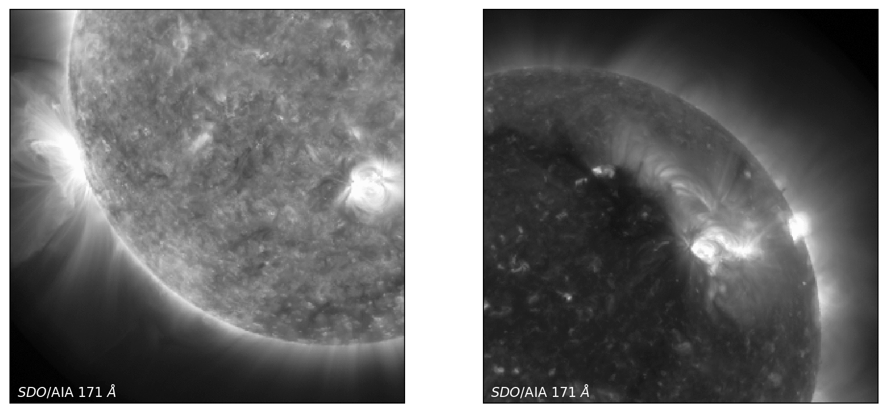

DeepEM: A Deep Learning Approach for DEM Inversion
============================================
*by Paul Wright, Mark Cheung, Rajat Thomas, Richard Galvez, Alexandre Szenicer, Meng Jin, Andrés Muñoz-Jaramillo, and David Fouhey*

In this chapter we will introduce a deep learning approach for Differential Emission Measure (DEM) Inversion: DeepEM. <i>For this notebook</i>, `DeepEM` is a trained on one set of <i>SDO</i>/AIA observations (six optically-thin channels; 6 x N x N) and DEM solutions (in 18 temperature bins from logT = 5.5 - 7.2 K, 18 x N x N; [Cheung et al 2015](https://doi.org/10.1088/0004-637X/807/2/143)) at a resolution of 512 x 512 (N = 512) using a 1x1 2D Convolutional Neural Network with a single hidden layer.

The `DeepEM` example presented here takes every DEM solution with no regards to the quality or existence of the solution. As will be demonstrated, when this method is trained with a single set of <i>SDO</i>/AIA images and DEM solutions, `DeepEM` solutions have a similar fidelity to Basis Pursuit (with a significantly increased computation speed—on the order of 10 million DEM solutions per second), and additionally, `DeepEM` finds positive solutions for every pixel.

This notebook was developed with [PyTorch](https://pytorch.org/), and `DeepEM` is currently being under development at https://github.com/PaulJWright/DeepEM.

Example of the `DeepEM` solutions for logT ~ 5.9 K and 6.3 K in comparison to the Basis Pursuit (and <i>SDO</i>/AIA images) for the same temperature.

